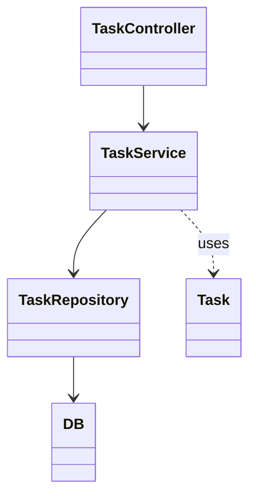

# Breakable Toy Api by Diego Escalante Maldonado 
# Breakable Toy Back-End

Spring Boot API for Breakable Toy — supports to-do management with persistent storage.

---

## Features

- RESTful API for to-do operations
- Spring Data JPA + PostgreSQL/MySQL
- Validation and error handling
- Unit & integration tests
- OpenAPI/Swagger docs at `/swagger-ui.html`

---

## Architecture



---

## Local Setup

1. Ensure PostgreSQL/MySQL is running (see root `docker-compose.yml`).
2. Configure database connection in `src/main/resources/application.properties`:
   ```
   spring.datasource.url=${DB_URL}
   spring.datasource.username=${DB_USER}
   spring.datasource.password=${DB_PASSWORD}
   spring.jpa.hibernate.ddl-auto=update
   ```
3. Start the API:
   ```bash
   ./mvnw spring-boot:run
   ```
   or
   ```bash
   ./gradlew bootRun
   ```

---

## API Endpoints

See the [root README](../README.md#api-reference) for examples.

---

## Entity Example

```java
@Entity
public class Task {
    @Id @GeneratedValue
    private Integer id;
    private String title;
    private LocalDate dueDate;
    private Boolean completed;
    private String priority;
    private LocalDate createDate;
    private LocalDate doneDate;
    // getters/setters
}
```

---

## Testing

```bash
./mvnw test
```

---

## OpenAPI/Swagger

API docs are auto-generated at [http://localhost:8080/swagger-ui.html](http://localhost:8080/swagger-ui.html).

---

## Learn More

- [Spring Boot](https://spring.io/projects/spring-boot)
- [Spring Data JPA](https://spring.io/projects/spring-data-jpa)
- [OpenAPI](https://swagger.io/specification/)
## Purpose
The purpose for this Api is to manage the back-end of an <i>To Do App</i>.
## Storage
Maria DB - Database: todos -
## Models
### Task
I defined a <i>Task</i> model. The Task is an object with the next fields:
#### Id - An unique number that identifies the task
#### Title - The name of the task, a String
#### dueDate - The date when the task should be completed
### completed - A boolean that represents if the task is completed
#### doneDate - The date when the task was checked as completed 
#### priority - Is a string that can be "Low", "Medium" or "High" 
#### createDate - The date when the task was created
## Controllers
### Task Controller
The <i>Task controller</i> handle all the http requests.
## Endpoints

### 1. Get All Tasks

**GET** `/api/todos`

**Description:**  
Returns a list of all tasks.

**Response Example:**
```json
[
  {
    "id": 1,
    "title": "Buy groceries",
    "dueDate": "2025-07-16",
    "completed": false,
    "priority": "High",
    "createDate": "2025-07-14",
    "doneDate": null
  }
]
```

---

### 2. Get Task By ID

**GET** `/api/todos/{id}`

**Description:**  
Returns the task with the specified ID.

**Response Example:**
```json
{
  "id": 1,
  "title": "Buy groceries",
  "dueDate": "2025-07-16",
  "completed": false,
  "priority": "High",
  "createDate": "2025-07-14",
  "doneDate": null
}
```

---

### 3. Search Tasks

**GET** `/api/todos/search?title={title}&priority={priority}&completed={completed}`

**Description:**  
Returns tasks filtered by any combination of `title`, `priority` ("Low", "Medium", "High"), and `completed` (`true`/`false`).

**Example:**  
`/api/todos/search?title=book&priority=High&completed=false`

---

### 4. Create a Task

**POST** `/api/todos`

**Description:**  
Create a new task.

**Request Body Example:**
```json
{
  "title": "Read a book",
  "dueDate": "2025-07-18",
  "priority": "Medium"
}
```

**Response Example:**
```json
{
  "id": 2,
  "title": "Read a book",
  "dueDate": "2025-07-18",
  "completed": false,
  "priority": "Medium",
  "createDate": "2025-07-14",
  "doneDate": null
}
```

---

### 5. Update a Task

**PUT** `/api/todos/{id}`

**Description:**  
Update the title, due date, or priority of an existing task.

**Request Body Example:**
```json
{
  "title": "Read a novel",
  "priority": "Low"
}
```

---

### 6. Mark Task as Done

**PUT** `/api/todos/{id}/done`

**Description:**  
Mark a task as completed and set its `doneDate` to the current date.

---

### 7. Mark Task as Undone

**PUT** `/api/todos/{id}/undone`

**Description:**  
Mark a task as not completed and clear its `doneDate`.

---

### 8. Delete a Task

**DELETE** `/api/todos/{id}`

**Description:**  
Delete the task with the specified ID.

---

### 9. Sort Tasks by Priority

**GET** `/api/todos/sortPriorityUp`  
**GET** `/api/todos/sortPriorityDown`

**Description:**  
Returns the list of tasks sorted by priority in ascending or descending order.

---

### 10. Sort Tasks by Due Date

**GET** `/api/todos/sortDueDateUp`  
**GET** `/api/todos/sortDueDateDown`

**Description:**  
Returns the list of tasks sorted by due date in ascending or descending order.

---

## Error Responses

- 400 Bad Request — Invalid input, missing required fields.
- 404 Not Found — Task with specified ID does not exist.
- 500 Internal Server Error — Unexpected error.

---
